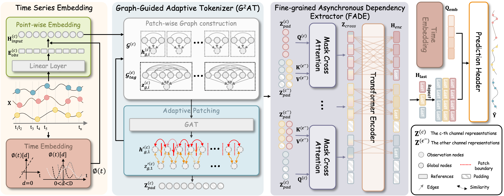

# TiWeaver: Unified Temporal Dynamics Modeling via Contextual Patching

This repository contains the PyTorch implementation of ARROW, **"TiWeaver: Unified Temporal Dynamics Modeling via Contextual Patching"**. In this paper, we propose TiWeaver to adaptively handle temporal dynamics across diverse multivariate time series. 
Our model include four core modules: Time Series Embedding, Graph-Guided Adaptive Tokenizer (G$^2$AT), Fine-Grained Asynchronous Dependency Extractor (FADE) and Prediction Header.



## Install

First, you should install the dependencies as listed in `requirements.txt` and activate the environment:

```bash
conda create -n TiWeaver python=3.10
conda activate TiWeaver
```

Then, you should install packages:

```bash
pip install -r requirements.txt
```

## Prepaer Datasets

You can obtained the well pre-processed datasets from [Google Drive](https://drive.google.com/file/d/1rl1dxt81IRMRrODaaHHHbQPABDhIZF2R/view?usp=sharing). Create a folder named `./dataset` and organize it as follows:
```
dataset/
├── exchange/
│   ├── exchange.csv
│   ├── exchange_freq.csv
│   └── exchange_masked_20pct.csv
├── weather/
│   ├── weather.csv
│   ├── weather_freq.csv
│   └── weather_masked_20pct.csv
├── zafnoo/
│   ├── zafnoo.csv
│   ├── zafnoo_freq.csv
│   └── zafnoo_masked_20pct.csv
├── HumanActivity/
│   ├── preprocessed/
│   └── raw/
├── USHCN/
│   ├── preprocessed/
│   └── raw/
└── P12/
    ├── preprocessed/
    └── raw/
```

## Run Experiments
We provide the experiment scripts under the folder `./Run/scripts`. You can run this repository as follows:

```shell
sh .Run/scripts/humanactivity.sh
```

## Citation

If you find this repository useful for your research, please consider citing:

```
@inproceedings{li2026TiWeaver,
  title={TiWeaver: Unified Temporal Dynamics Modeling via Contextual Patching},
  author={Li, Zhe and Tian, Jindong and Miao, Hao and Lei, Zhi and Guo, Chenjuan and Yang, Bin},
  booktitle={SIGKDD},
  year={2026}
}
```